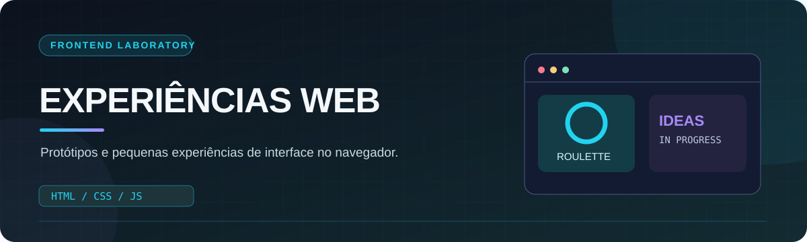
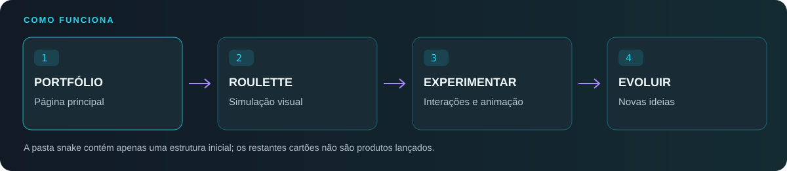

  
    
  
  
  
  <h3>Experimentar, perceber e melhorar.</h3>
  
<a href="#o-que-existe">Explorar projetos</a> · <a href="#executar-localmente">Executar</a> · <a href="#estado-e-próximos-passos">Evolução</a>

## Um espaço para experimentar

Reúno aqui pequenas experiências de interface e JavaScript que desenvolvo para explorar animação, eventos, organização de código e interação no navegador. Nem todas as ideias estão concluídas: este é um espaço de **aprendizagem e prototipagem**, não um catálogo de aplicações prontas.

<table><tr>
<td width="50%" valign="top"><h3>01 · Interface</h3>
Experimentações de layout, estados visuais e navegação.
</td>
<td width="50%" valign="top"><h3>02 · JavaScript</h3>
Eventos, lógica de interação e controlo de elementos da página.
</td>
</tr><tr>
<td valign="top"><h3>03 · Canvas</h3>
Desenho e animação numa experiência de roleta simulada.
</td>
<td valign="top"><h3>04 · Evolução</h3>
Ideias que podem crescer até se tornarem projetos independentes.
</td>
</tr></table>

## O que existe

| Localização | Estado verificado | Conteúdo |
| :--- | :--- | :--- |
| `index.html` | Página inicial implementada | Portefólio visual com cartões de experiências. |
| `roleta/` | Protótipo implementado | Simulação visual de roleta europeia em Canvas, com valores fictícios e histórico local de resultados. Não envolve dinheiro real. |
| `snake/index.html` | Estrutura inicial | O ficheiro ainda não contém o jogo. |
| Outros cartões da página inicial | Ideias de evolução | Não correspondem a projetos publicados neste repositório. |

**Os cartões da página principal podem representar experiências ainda não concluídas.** Esta distinção é intencional para que seja claro o que podes realmente testar.

## Executar localmente

Não é necessário instalar Node.js, dependências ou uma base de dados.

~~~bash
git clone https://github.com/NexysT/IA.git
~~~

Abre `index.html` no navegador para veres o portefólio. Para inspecionar o protótipo de Canvas, abre o HTML na pasta `roleta/`. Estes ficheiros são executados localmente no navegador.

## Estrutura do projeto

~~~text
IA/
├── index.html        Página inicial
├── style.css         Estilos do portefólio
├── script.js         Animações e interações
├── roleta/
│   ├── index.html    Interface da simulação
│   ├── style.css     Apresentação
│   └── script.js     Canvas e lógica
├── snake/
│   └── index.html    Estrutura ainda vazia
├── assets/           Capa e fluxo do README
└── README.md         Documentação
~~~

## Estado e próximos passos

- Terminar uma experiência antes de a apresentar como disponível.
- Acrescentar instruções específicas aos protótipos que cresçam.
- Melhorar a navegação por teclado e em dispositivos móveis.
- Separar projetos maiores em repositórios próprios.

> [!NOTE]
> Um portefólio experimental é mais útil quando o estado de cada projeto é explícito. Este repositório documenta o que existe no código atualmente; não promete funcionalidades ainda por construir.

 Experiências de <a href="https://github.com/NexysT">Carlos Pereira / NexysT</a> · Desenvolvimento frontend

